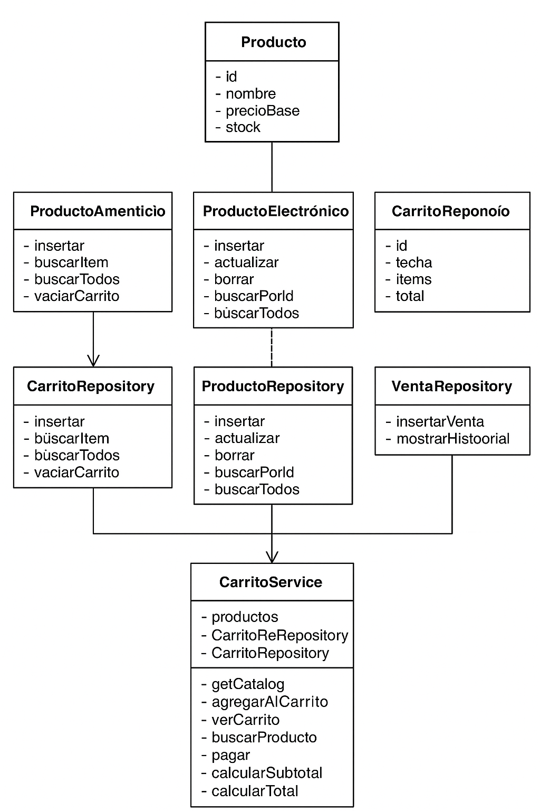

# 🛒 Market Management System – Overview

This project is a simple market management system implemented in Java using a clean and modular architecture.
It is divided into five main layers:

* **exception**
* **model**
* **repository**
* **service**
* **ui**

The goal is to practice separation of concerns and prepare the codebase for future scalability (e.g., JPA, databases, REST APIs).

---

## 📦 Model Layer

This layer contains the domain entities.
All classes are **POJOs** (Plain Old Java Objects) with fields, constructors, and getters/setters.
They will be ready for future JPA/Hibernate annotations.

### **CarritoItem**

Represents an item inside the shopping cart.
Attributes:

* `cantidad` (int)
* `producto` (Producto)

### **Producto (abstract)**

Base class for products in the system.
Attributes:

* `id` (int)
* `nombre` (String)
* `precioBase` (double)
* `stock` (int)

### **ProductoAlimenticio**

Extends `Producto`.
New attribute:

* `fecha_caducidad` (Date)

### **ProductoElectronico**

Extends `Producto`.
New attribute:

* `garantia` (int)

### **Venta**

Represents a completed sale.
Attributes:

* `id`
* `fecha`
* `items` (List<CarritoItem>)
* `total` (double)

---

## 🗃️ Repository Layer

This layer defines *interfaces* that describe how data is accessed.
Each repository has an in-memory implementation using `Map` to store data.

### **CarritoRepository**

* `insertar(id, item)`
* `buscarItem(id)`
* `buscarTodos()`
* `vaciarCarrito()`

### **ProductoRepository**

* `insertar()`
* `actualizar()`
* `borrar()`
* `buscarPorId()`
* `buscarTodos()`

### **VentaRepository**

* `insertarVenta()`
* `mostrarHistorial()`

Memory implementations:

* `CarritoRepositoryMemory`
* `ProductoRepositoryMemory`
* `VentaRepositoryMemory`

These mimic a database and will be replaceable by JPA in the future.

---

## ⚙️ Service Layer

This layer contains the business logic.

### **CarritoService**

Uses:

* `ProductoRepository` (product catalog)
* `CarritoRepository` (current cart)
* `VentaRepository` (sale history)

Implements:

* `getCatalog()` → returns all products
* `agregarAlCarrito(id, cantidad)`
* `verCarrito()`
* `buscarProducto(id)`
* `calcularSubtotal(item)`
* `calcularTotal(items)`
* `pagar()` → creates a `Venta`, adds to history, and empties the cart

---

## 🖥️ UI Layer

This layer handles console input/output.

### **MenuPrincipal**

Contains:

* A `Scanner`
* Methods to display menus, show catalog, show cart, show product info, show sale info
* Utility methods: `pedirID`, `pedirCantidad`, `pausar`

---

## ▶️ Main

The `Main` class coordinates the entire flow:

1. Instantiates repositories (catalog, empty cart, sale history)
2. Instantiates the service
3. Instantiates the UI
4. Runs a `while` loop with a `switch` menu:

    * **1:** Show catalog and add items to cart
    * **2:** View current cart
    * **3:** Pay → generate a sale and store it
    * **4:** Exit

Aquí tienes un **recordatorio profesional, corto y claro** para poner al final de tu README:

---

## ⚠️ Pending Improvements (To-Do)

This project is functional, but several improvements are planned for the next iteration:

* Add custom exceptions for validation and error handling
* Refactor services into smaller, more cohesive units
* Further separate UI logic from business logic
* Improve domain models (POJOs) to prepare for future scalability (JPA, REST APIs, databases)

These upgrades will make the system more robust, modular, and easier to extend.

---

